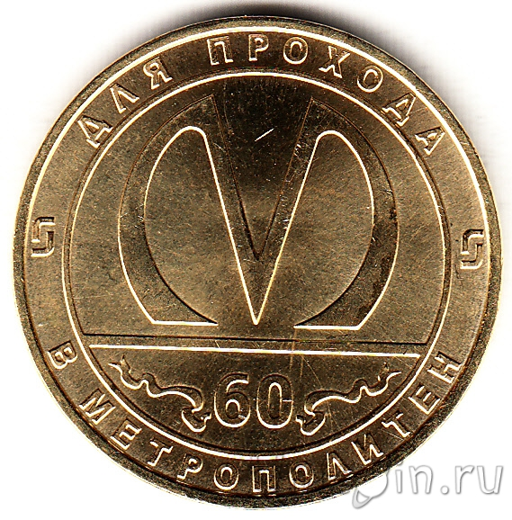

# Инструкция для работы в Marcdown.

- ## Выделение текста
Чтобы выделить текст курсивом, необходимо обрамить его звездочками (*). Например, *вот так*. 
Альтернативные выделения курсивом и жирным необходимо для того, чтобы одновременно выделять используя разные способы.
- ## Списки
Чтобы выделить списки пользуйся головой

- ## Работа с изображениями
Как вставить картинку:

- ## Ссылки

- ## Работа с таблицами

- ## Цитаты
- ## Заключение

